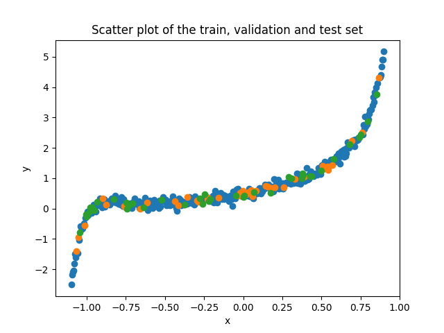
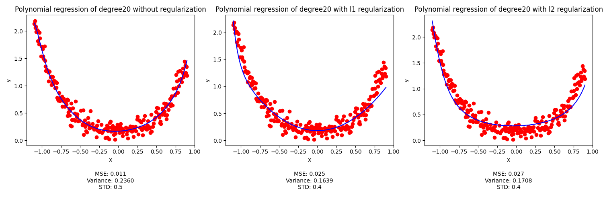

# Assignment 1 Report

## KNN

### Data Preprocessing

#### 1. Skewed data
If the feature has mean greater than median, then it is right skewed. If the feature has mean less than median, then it is left skewed.

From the mean_median.png plot, we can see that the following features are skewed:

For the given dataset, the following features are skewed:
- popularity is right skewed
- duration_ms is right skewed
- danceability is left skewed
- energy is left skewed
- key is right skewed
- loudness is left skewed
- mode is left skewed
- speechiness is right skewed
- acousticness is right skewed
- instrumentalness is right skewed
- liveness is right skewed
- valence is right skewed
- tempo is right skewed
- time_signature is left skewed

#### 2. Outliers
From the blox plots of features, if black circles are present, then it indicates the presence of outliers.

From the box plots, the following features have outliers:
- Number of outliers in popularity is 11
- Number of outliers in duration_ms is 4225
- Number of outliers in danceability is 474
- Number of outliers in energy is 0
- Number of outliers in key is 0
- Number of outliers in loudness is 5026
- Number of outliers in mode is 0
- Number of outliers in speechiness is 10644
- Number of outliers in acousticness is 0
- Number of outliers in instrumentalness is 19613
- Number of outliers in liveness is 6981
- Number of outliers in valence is 0
- Number of outliers in tempo is 514
- Number of outliers in time_signature is 10197

#### 3. Correlation
- For, categorical features i drew a bar plot which says how many genres are there for each value of the feature.
So, here for artits vs genres, Each artist has only one genre. so, it is highly correlated. similarly we infere for other features.

- For, numerical features i have drawn scatter plots to see the correlation between the features. If the scatter plot is linear, then the features are highly correlated. If the scatter plot is not linear, then the features are not correlated. From scatter plots it is difficult to observe correlation. So, i have calculated the correlation for each feature and genre.

So, the correlation orders and values are as follows:
 - 'acousticness': 0.08766724437969552
 - 'speechiness': 0.08726121792174445,
 - 'energy': 0.06186223346685622,
 - 'instrumentalness': 0.04987703614460874, 
 - 'liveness': 0.04866683278704913, 
 - 'loudness': 0.04347641425054296, 
 - 'popularity': 0.037407435641021024, 
 - 'valence': 0.03562638411815547, 
 - 'tempo': 0.03230312615817299, 
 - 'time_signature': 0.03037960615354139, 
 - 'duration_ms': 0.02936320086224687, 
 - 'danceability': 0.026585974896143984, 
 - 'key': 0.009180519233647641, 
 - 'mode': 0.005649680843283021

### Hyperparameter Tuning and Model Selection
1. I have ran and seen the accuaracy of validation set for k=1 to 30 for each distance metric. and found the best pair of k and distance metric which gives the best validation accuracy and also top 10 such pairs.
- Best {k, distance metric} pair that gives the best validation accuracy for an 80:10:10 split (train:test:validation)
    - {k: 16, distance metric: 'manhattan'}

- Top 10 {k, distance metric} pairs that gives the best validation accuracy for an 80:10:10 split (train:test:validation)
    - The model with distance metric manhattan, k=16 and accuracy of 0.35903721863160243
    - The model with distance metric manhattan, k=15 and accuracy of 0.3585914865166035
    - The model with distance metric manhattan, k=17 and accuracy of 0.3584800534878538
    - The model with distance metric manhattan, k=21 and accuracy of 0.35703142411410743
    - The model with distance metric manhattan, k=20 and accuracy of 0.3569199910853577
    - The model with distance metric manhattan, k=22 and accuracy of 0.35658569199910856
    - The model with distance metric manhattan, k=23 and accuracy of 0.3560285268553599
    - The model with distance metric manhattan, k=19 and accuracy of 0.3559170938266102
    - The model with distance metric manhattan, k=24 and accuracy of 0.3554713617116113
    - The model with distance metric manhattan, k=28 and accuracy of 0.3554713617116113

2. I have used the best pair of k and distance metric to predict the accuracy of data in which we drop the each feature columns.
- The accuaracy of model increased when 
    - we drop the track_name to 0.3673946957878315
    - we drop explicit to 0.36750612881658123
    - we drop energy to 0.36349453978159124
    - we drop key to 0.3798751950078003
    - we drop mode to 0.3756407399153109
    - we drop speechiness to 0.36126587920659686
    - we drop livliness to  0.372409182081569
    - we drop valence to 0.36104301314909737
    - we drop time_signature to 0.372409182081569

### Optimization
- My Initial_KNN model is taking too much time to predict the accuarcy of validation set. It almost takes one second predict outcome of one datapoint for sinle k, distance_metric pair.
So, the time increases as number of training points increase for Initial_KNN model.

- For, Optimized_KNN model i used vectorization. Here also the time increases as number of training points increase but the time taken is very less compared to Initial_KNN model. It takes 112 seconds to predict the accuarcy of validation set for whole training points. Here time is almost increasing from 2 seconds to 14 seconds as training points increase.

- For, sklearn_KNN model, time is almost flucates from 0.2 to 0.5 seconds as training points increase.

### For second dataset
I have used the best model which has k=16 and distance metric as manhattan to predict the accuracy on test set of second dataset.

- accuracy : 0.14387580106507808
- macro precision : 0.1335168269629663
- macro recall : 0.1435734399577718
- macro f1_score : 0.138362637939954
- micro precision : 0.14387580106507808
- micro recall : 0.14387580106507808
- micro f1_score : 0.14387580106507808

## Regression

### Metrics of splitted data:
- For Train set:
    - Means for train set: 0.7736619518120339
    - variances for train set: 1.2540180948409425
    - Stds for train set: 1.1198294936466633
- For Validation set:
    - Means for validation set: 0.6411228801641915
    - variances for validation set: 0.8562885851833428
    - Stds for validation set: 0.9253586251736906
- For Test set:
    - Means for test set: 0.6945646228046127
    - variances for test set: 0.8688196055964708
    - Stds for test set: 0.9321049327175942

Visulaization of splitted data:

### Linear Regression
#### Hyper parameter tuning for learning rate
I tried learning rate = 0.1, 0.2, 0.3, 0.01, 0.001 among these learning rates, 0.1 is the best learning rate which gives the best. So, i have used learning rate = 0.1 for further calculations.

- MSE = 0.2703457804627422 when n = 0.1
- MSE = 0.27049913430318673 when n = 0.2
- MSE = 0.27049923072970894 when n = 0.3
- MSE = 0.3413269847406642 when n = 0.01
- MSE = 1.6622969775123437 when n = 0.001

Metrics on test set and train set:
- For Test set:
    - MSE: 0.2548792585935666
    - Std: 0.9916388747654113
    - Var: 0.9833476579460111

- For Train set:
    - MSE: 0.37362398185695306
    - Std: 0.935309847243649
    - Var: 0.8748045103509379

###  Polynimial Regression

#### Hyper parameter tuning for degree and learning rate
1. For learning rate,
- MSE = 0.05980225200355634 when n = 0.1
- MSE = 0.27828523986609643 when n = 0.01
- MSE = 1.9031137932578255 when n = 0.001
So, finally we can say that n = 0.1 is the best learning rate for this model

2. For degree,
- For k = 1 to 25 and learning rate = 0.1, then MSE:
    - MSE on test set for degree 1 is : 0.2548792585935666
    - MSE on train set for degree 1 is : 0.37362398185695306
    - MSE on test set for degree 2 is : 0.10515156538233257
    - MSE on train set for degree 2 is : 0.25649790317108007
    - MSE on test set for degree 3 is : 0.08494968573755049
    - MSE on train set for degree 3 is : 0.17675056221336655
    - MSE on test set for degree 4 is : 0.07953249709853794
    - MSE on train set for degree 4 is : 0.17848298975835072
    - MSE on test set for degree 5 is : 0.05881191683812511
    - MSE on train set for degree 5 is : 0.09939438006340767
    - MSE on test set for degree 6 is : 0.060115571850386074
    - MSE on train set for degree 6 is : 0.10019275022502579
    - MSE on test set for degree 7 is : 0.04857897806751506
    - MSE on train set for degree 7 is : 0.06270574875962576
    - MSE on test set for degree 8 is : 0.04495017055663064
    - MSE on train set for degree 8 is : 0.06028877887257918
    - MSE on test set for degree 9 is : 0.04112571420930198
    - MSE on train set for degree 9 is : 0.04937456733881928
    - MSE on test set for degree 10 is : 0.04409693481295625
    - MSE on train set for degree 10 is : 0.04962331437522325
    - MSE on test set for degree 11 is : 0.034886830540704517
    - MSE on train set for degree 11 is : 0.038809701012935724
    - MSE on test set for degree 12 is : 0.03438399617611321
    - MSE on train set for degree 12 is : 0.038305384435494805
    - MSE on test set for degree 13 is : 0.01760448578626412
    - MSE on train set for degree 13 is : 0.02681954181983698
    - MSE on test set for degree 14 is : 0.020833464104603894
    - MSE on train set for degree 14 is : 0.02609362828071226
    - MSE on test set for degree 15 is : 0.011726184397339861
    - MSE on train set for degree 15 is : 0.022083570741819325
    - MSE on test set for degree 16 is : 0.012558446040535381
    - MSE on train set for degree 16 is : 0.024965865392042715
    - MSE on test set for degree 17 is : 0.012117662373199306
    - MSE on train set for degree 17 is : 0.02437374339428342
    - MSE on test set for degree 18 is : 0.012017960752303849
    - MSE on train set for degree 18 is : 0.022932011008467475
    - MSE on test set for degree 19 is : 0.011915574796897345
    - MSE on train set for degree 19 is : 0.02344797866273881
    - MSE on test set for degree 20 is : 0.013744999018432477
    - MSE on train set for degree 20 is : 0.026557976264242555
    - MSE on test set for degree 21 is : 0.015134008602221105
    - MSE on train set for degree 21 is : 0.027852083170648745
    - MSE on test set for degree 22 is : 0.012216760719630935
    - MSE on train set for degree 22 is : 0.023572429239329337
    - MSE on test set for degree 23 is : 0.013661950603169937
    - MSE on train set for degree 23 is : 0.02537004511644427
    - MSE on test set for degree 24 is : 0.01440608003219605
    - MSE on train set for degree 24 is : 0.02662465804511436
    - MSE on test set for degree 25 is : 1.627574843730038e+16
    - MSE on train set for degree 25 is : 4.094223904842134e+16

Degree 15, the MSE on test set is 0.011726184397339861, which is the best degree for this model. So, i have used degree = 15 for further calculations.
- For best model the metrics of both train and test set are:
    - Variance on test set for degree 15 is : 0.8843715722549215
    - Variance on train set for degree 15 is : 1.1736086803577561

    - Standard Deviation on test set for degree 15 is : 0.9404103212188398
    - Standard Deviation on train set for degree 15 is : 1.0833322114465886

## Regularization
To compare the effect of regularisation, i am showing the plots of degree 20 for both L1 and L2 regularisation and without regularisation.

From the above plot, we can see that:
- Metrics without regularisation are:
    - MSE on train set = 0.011
    - variance on train set = 0.2360
    - std on train set = 0.5016
- Metrics after L1 regularisation are:
    - MSE on test set = 0.026
    - variance on test set = 0.1639
    - std on test set = 0.3997
- Metrics after L2 regularisation are:
    - MSE on test set = 0.027
    - variance on test set = 0.1708
    - std on test set = 0.4234

Theoritically, After regularisation the model variance decreases and bias increases compared to model but MSE of model increases since we are adding the regularisation term to the loss function. So, the model is not overfitting and it is generalizing well.

- In the above plot, we can see that 

    MSE(l1)==MSE(l2) > MSE(no regularisation)

    variance(l1) < variance(l2) < variance(no regularisation)

    std(l1) < std(l2) < std(no regularisation).

    So, we can say that the model is not overfitting and it is generalizing well than the model without regularisation.

- Among L1 and L2 regularisation, for degree from 5 to 20 MSE is almost same for both L1 and L2 regularisation is same. But,
almost for every degree variance for L1 regularisation is less than L2 regularisation. So, to generalize the model well, we can use L1 regularisation.