# Assignment 2

## 1. K-Means Clustering
- The optimal number of clusters is found using the elbow method.
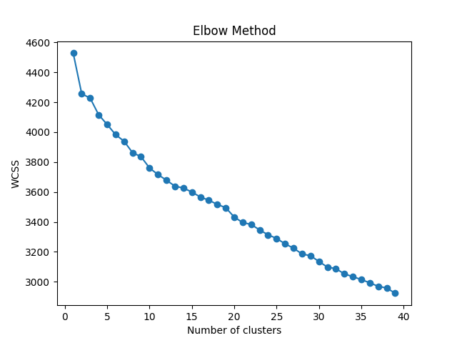

So, from the above plot we can say that the optimal number of clusters are K_kmeans1 = 7. beacuse after 7 the slope is has a significant change.

## 2. Guassian Mixture Model
- The optimal number of clusters is found using the AIC and BIC values.
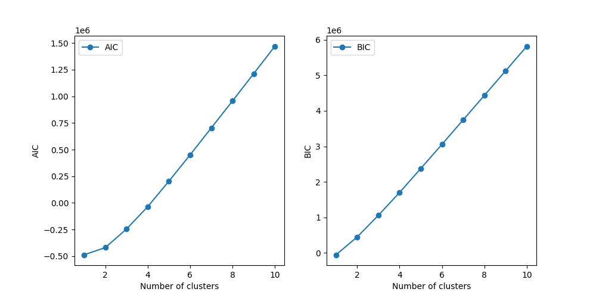

So, from the above plot we can say that the optimal number of clusters are K_gmm1 = 2. Actully from the plot it is not clear but i have taken the number of clusters as 2 beacuse there is some significant change in the slope after 2.

## 3. Dimensionality Reduction and Visulaization
512-dimensional data is reduced into 2Dimensions and 3Dimensions. And the reduced data is visualized using scatter plot.

- The checkPCA method for 2D is giving output 'True'.
- The checkPCA method for 3D is giving output 'True'.

#### 2-Dimesional data:
1. without labels

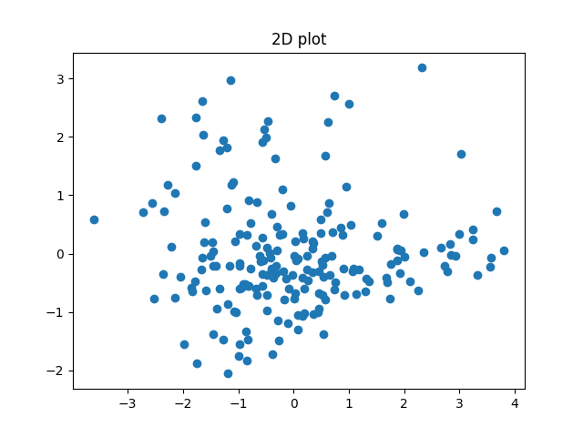

2. with labels

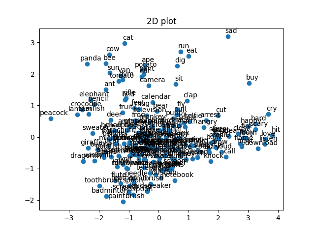

#### 3-Dimesional data:

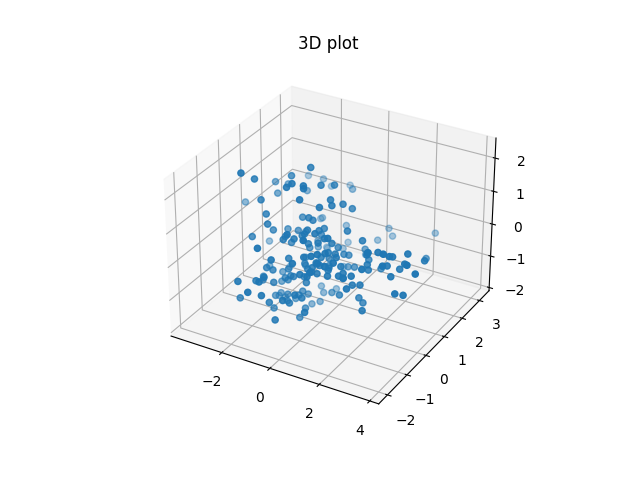

- New axes that are obtained by PCA are for 2D data.
- The first axis is the most important and explains the most variance in the data. From the labels plot we can also say that the first axis is separating the verbs and nouns.
- The second axis is the second most important and explains the second most variance in the data. From the labels plot i am not able to particularly say what the second axis is separating.

- Approximate number of clusters in 2D data is K2 = 3

## 4. PCA + Clustering
- Kmeans and Gmm clustering on the dataset using the number of clusters estimated from the 2D visualization of the dataset (k2 = 3).

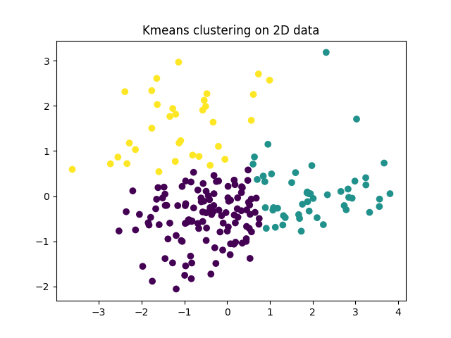

#### Optimal dimensions
- The scree plot to find optimal dimensions of the data is shown below:

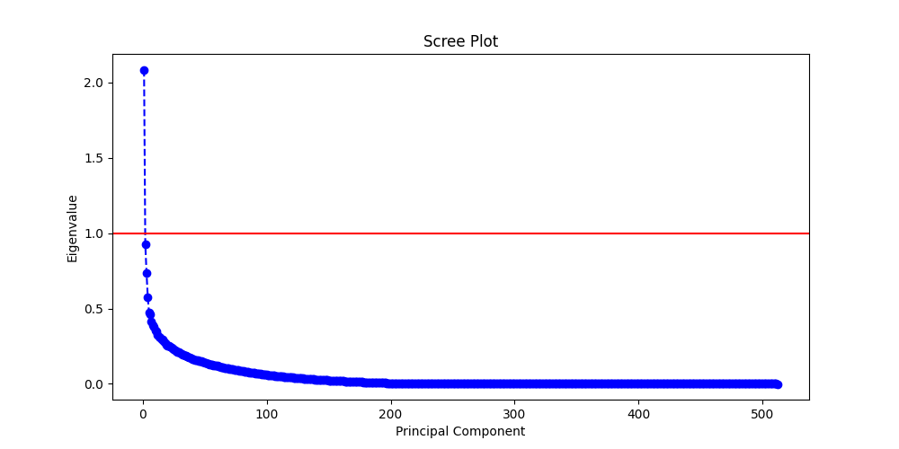

- Cummulative explained variance plot is shown below:
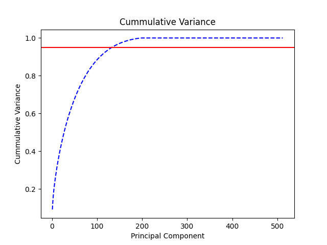

From the above cummulative explained covariance plot, we can see that the optimal number of dimensions are 136.Now we can form the reduced data of word embeddings using the optimal number of dimensions.

- Optimal number of clusters on reduceddata using Kmeans. The Elbow plot is shown below:

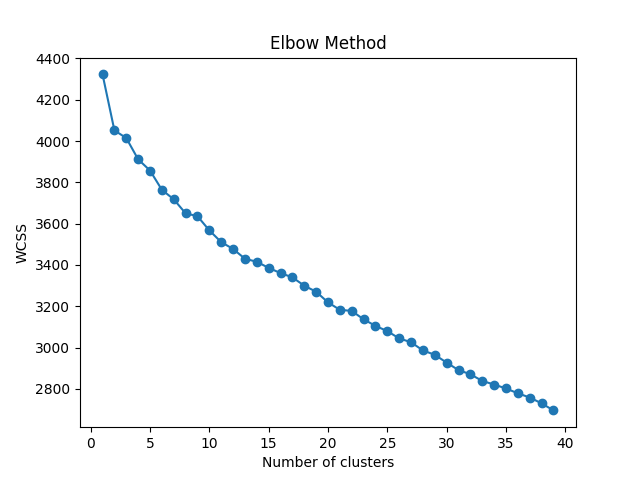

So, the optimal number of clusters on reduced data using Kmeans are K_kmeans3  = 4.

- Optimal number of clusters on reduceddata using GMM. The AIC, BIC values plot is shown below:

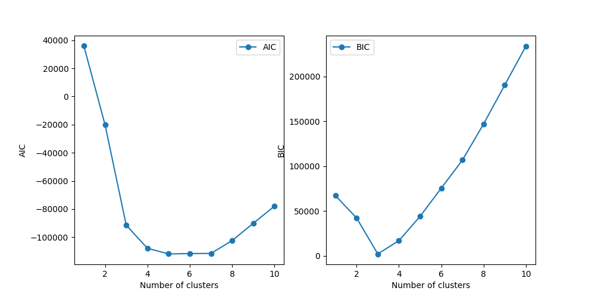

So, the optimal number of clusters on reduced data using GMM are K_gmm3  = 5.

## 5. Cluster Ananlysis
### K-means Clustering:
- Now we will compare the clusteriing results of Kmeans clustering on the original data with number of clusters as K-kmeans1, K2, K_kmeans3.(Using coherence and meaningfullness of the clusters)

#### when clusters = K_kmeans1:
- In this there are 7 clusters.
- In cluster 4,5 theer are no verbs and totally consists of nouns. but there nouns are not divided into natural and artificila things significantly.(with only run, dig as verbs in cluster 4).
- Cluster 0 contains only one element.
- Cluster 1.0: Predominantly action verbs and objects related to movement and interaction, including words like 'drive', 'sing', 'listen', and 'smile'.
- Cluster 2, 5 are related to natural elements likeLiving creatures and nature-related items 
- Cluster 3, 6 shows Various objects and items associated with daily activities and tools
- Cluster 4 : Broad set of actions, emotions, and common objects

#### when clusters = K2:
- In cluster 2 : Almost all are nouns which are both natural and artificial things.
- In cluster 0 : In this cluster only some points are there and almost nouns, features.
- In cluster 1 : In this cluster almost all are actions and verbs with some nouns.

#### when clusters = K_kmeans3:
- In cluster 2 : Almost all the words verbs and actions with some 4-5 nouns.
- In cluster 1 : In this also almost all are nouns which are naturally related things like animals, plants etc...but contains some artificial things like 'helicopter', 'pant' etc...
- In cluster 3 : In this cluster almost all are nouns and all are tools, onjects made by man.
- In cluster 0 : It contains only saturn, earth. Which are only planets given in dataset.

##### Among the above clustering may be K-kmeans1 is showing more features which i may not observe but i felt there are some clusters without any significant pattern. So, i feel K_kmeans3 is better.

### GMM Clustering:
- Now we will compare the clusteriing results of GMM clustering on the original data with number of clusters as K_gmm1, K2, K_gmm3.(Using coherence and meaningfullness of the clusters)

#### when clusters = K_gmm1:
- Cluster 0: Mixed group including actions(verbs)
- Cluster 1: Contains actions(verbs) and objects
- There are no significant patterns in the clusters.

#### when clusters = K2:
- Cluster 0: It includes a diverse set of items such as actions (e.g., 'drive', 'fight'), animals (e.g., 'deer', 'giraffe'), and tools (e.g., 'eraser', 'basket').
- Cluster 1 : Focus on various actions and objects, but with slightly different terms and more emphasis on nature and activities.
-  Cluster 2 : A new cluster contains almost only nouns, with a focus on animals and objects.

#### when clusters = K_gmm3:
- Cluster 0: Contains a specific set of items related to actions and objects (e.g., 'drive', 'rose', 'dive', 'bucket', 'clean') with a clear focus on daily and interactive terms.
- Cluster 1: Focuses on emotions, nature, and objects (e.g., 'sing', 'sad', 'rain', 'throne', 'bicycle').
- Cluster 2: Includes a mix of nature-related and action terms (e.g., 'deer', 'eat', 'postcard', 'starfish', 'run').
- Cluster 3: A more focused cluster with a set of terms related to activities and objects (e.g., 'ape', 'listen', 'grass', 'giraffe', 'skate').

##### In Gmm all clusters not showing any significant patterns. But i feel K_gmm3 is better.

### Comparision between Kmeans and GMM:
- Kmeans is showing more significant patterns than GMM. So, Kmeans is better. from the above explanations i feel K_kmeans3 is better than K_gmm3.

## 6. Hirearchical Clustering
#### Different Linkage Methods:
1. Average Linkage: Produces balanced dendrograms with distinct clusters.
2. Complete Linkage: Forms more compact, spherical clusters.
3. Single Linkage: Tends to create chain-like structures, which may not always be desirable.
4. Ward's Linkage: Minimizes variance within clusters while maximizing variance between clusters, leading to compact, spherical clusters.

#### Best Method: Ward's linkage
I considered wards because it is mainly used for spherical clusters and it minimizes the variance within clusters. From previous graphs we observed it is kind of spherical clusters.
1. Best Metric: Euclidean distance
2. Agreement with K-Means and GMM:
To evaluate the agreement between hierarchical clustering and K-Means and GMM, I used the Adjusted Rand Index (ARI). If the ARI is close to 1, it indicates high similarity between the clusterings, while a score below 0 suggests dissimilarity.

#### Scores:
1. K-Means: 0.3474
2. GMM: 0.0425

From these scores, we can conclude that the hierarchical clustering shows some similarity to the K-Means clustering (not dissimilar), whereas its similarity to GMM is much lower.

## 7. Nearest neighbour search
The optimal dimensions that i got for dimesionality reduction on spotify data is 16 with 0.95 variance. I have applied KNN on the reduced data and original data.

I have done dimensionality reduction on spotify data then applied KNN on reduced data.The metrics are as follows:
- The accuracy of the model is: 0.19578783151326054
- The micro precision of the model is: 0.19578783151326054
- The macro precision of the model is: 0.19460767066409468
- The micro recall of the model is: 0.19578783151326054
- The macro recall of the model is: 0.17599305673429366
- The F1 micro score of the model is: 0.1957878315132605
- The F1 macro score of the model is: 0.18483287426091377

I have done KNN on original data. The metrics are as follows:
- The accuracy of the model is: 0.3691776242478271
- The micro precision of the model is: 0.3691776242478271
- The macro precision of the model is: 0.36903572610713287
- The micro recall of the model is: 0.3691776242478271
- The macro recall of the model is: 0.3326440968810003
- The F1 micro score of the model is: 0.3691776242478271
- The F1 macro score of the model is: 0.3498962113659285

The Accuracy, Precision, Recall, F1 score of the model on reduced data is less than the original data. because the reduced data will not have all information of the original data. So, the classification on reduced data is not as good as the original data. 

As we increase the dimensions of the reduced data the performance of the model will increase because the reduced data will have more information of the original data. So, the classification on reduced data is as good as the original data.

Also the comparision of inference time between the original data and reduced data is as follows:
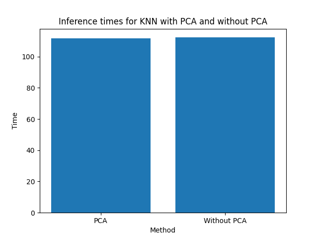