# Assignment-3

## Multilayer perceptron classification
### 2.1 Preprocessing
- Description of dataset using mean, median, mode, max, min, std, quartiles
```
Description of column: fixed acidity
    count    1143.000000
    mean        8.311111
    std         1.747595
    min         4.600000
    25%         7.100000
    50%         7.900000
    75%         9.100000
    max        15.900000
    Name: fixed acidity, dtype: float64

Description of column: volatile acidity
    count    1143.000000
    mean        0.531339
    std         0.179633
    min         0.120000
    25%         0.392500
    50%         0.520000
    75%         0.640000
    max         1.580000
    Name: volatile acidity, dtype: float64

Description of column: citric acid
    count    1143.000000
    mean        0.268364
    std         0.196686
    min         0.000000
    25%         0.090000
    50%         0.250000
    75%         0.420000
    max         1.000000
    Name: citric acid, dtype: float64

Description of column: residual sugar
    count    1143.000000
    mean        2.532152
    std         1.355917
    min         0.900000
    25%         1.900000
    50%         2.200000
    75%         2.600000
    max        15.500000
    Name: residual sugar, dtype: float64

Description of column: chlorides
    count    1143.000000
    mean        0.086933
    std         0.047267
    min         0.012000
    25%         0.070000
    50%         0.079000
    75%         0.090000
    max         0.611000
    Name: chlorides, dtype: float64

Description of column: free sulfur dioxide
    count    1143.000000
    mean       15.615486
    std        10.250486
    min         1.000000
    25%         7.000000
    50%        13.000000
    75%        21.000000
    max        68.000000
    Name: free sulfur dioxide, dtype: float64

Description of column: total sulfur dioxide
    count    1143.000000
    mean       45.914698
    std        32.782130
    min         6.000000
    25%        21.000000
    50%        37.000000
    75%        61.000000
    max       289.000000
    Name: total sulfur dioxide, dtype: float64

Description of column: density
    count    1143.000000
    mean        0.996730
    std         0.001925
    min         0.990070
    25%         0.995570
    50%         0.996680
    75%         0.997845
    max         1.003690
    Name: density, dtype: float64

Description of column: pH
    count    1143.000000
    mean        3.311015
    std         0.156664
    min         2.740000
    25%         3.205000
    50%         3.310000
    75%         3.400000
    max         4.010000
    Name: pH, dtype: float64

Description of column: sulphates
    count    1143.000000
    mean        0.657708
    std         0.170399
    min         0.330000
    25%         0.550000
    50%         0.620000
    75%         0.730000
    max         2.000000
    Name: sulphates, dtype: float64

Description of column: alcohol
    count    1143.000000
    mean       10.442111
    std         1.082196
    min         8.400000
    25%         9.500000
    50%        10.200000
    75%        11.100000
    max        14.900000
    Name: alcohol, dtype: float64

Description of column: quality
    count    1143.000000
    mean        5.657043
    std         0.805824
    min         3.000000
    25%         5.000000
    50%         6.000000
    75%         6.000000
    max         8.000000
    Name: quality, dtype: float64

Description of column: Id
    count    1143.000000
    mean      804.969379
    std       463.997116
    min         0.000000
    25%       411.000000
    50%       794.000000
    75%      1209.500000
    max      1597.000000
    Name: Id, dtype: float64
```

- Graph showing distribution of labels across the dataset


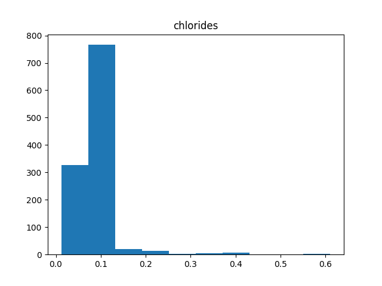


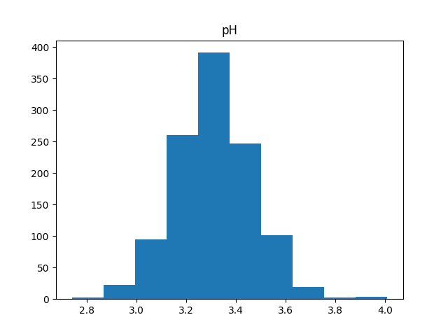
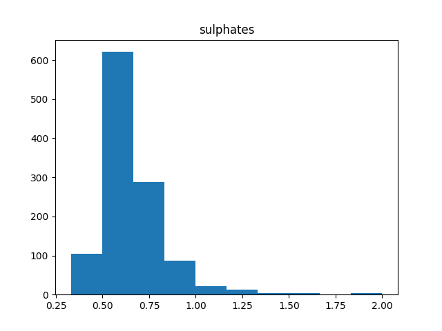
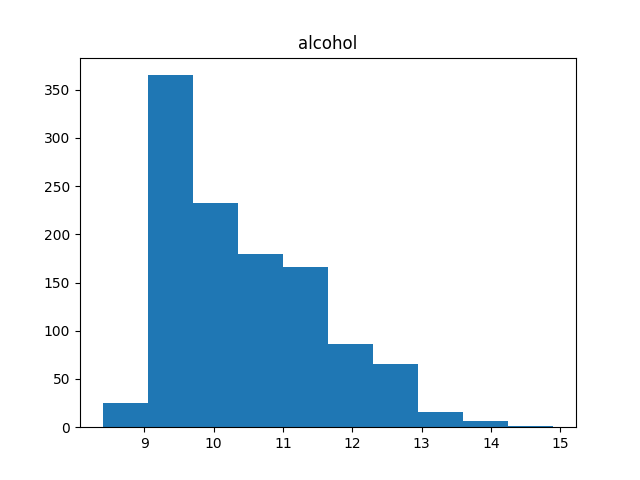
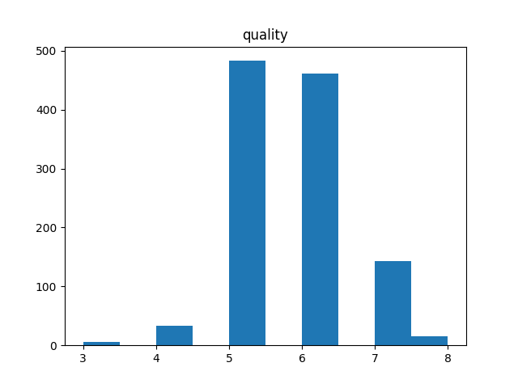
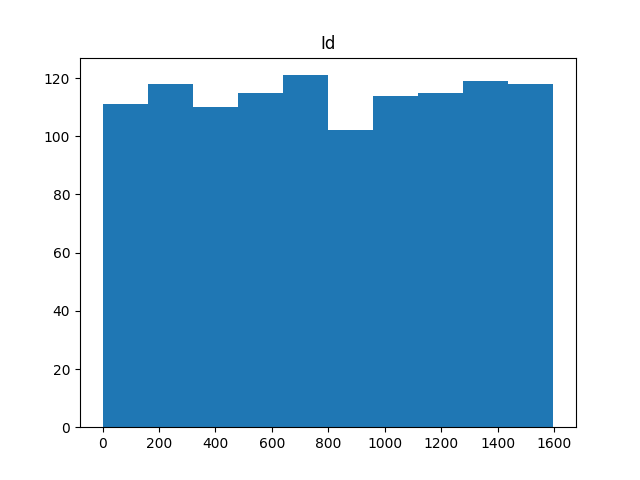

### 2.2 MLP Building for classification
- Gradient checking for the model
```
Epoch 1 Loss: 2.0251752152449725
Layer 1 weights relative difference: 5.628345641425078e-07
Layer 1 biases relative difference: 1.9397248931055284e-07
Layer 2 weights relative difference: 4.439850634895346e-07
Layer 2 biases relative difference: 1.1930095414486244e-07
Epoch 1 Loss: 2.0251752152449725
Epoch 2 Loss: 1.6116274570960392
Epoch 3 Loss: 1.39026970969539
```

### 2.3 Hyperparameter tuning
- link for wandb report
[Link Text](https://wandb.ai/keshava-kishora-iiit-hyderabad/smai_a3/sweeps/ck80ovkw?nw=nwuserkeshavakishora "Optional Title")

- plot the trend in accuracy with change in hyperparameters using wandb is shown in link

- Generate a table listing all the hyperparameters and their corresponding metrics is shown in link

- Provide the best hyperparameters and their corresponding metrics
```
- Best_hyperparameters :
    - lr = 0.1
    - epochs = 500
    - neurons = [64]
    - optimizer = mini-batch
    - activation = relu
```

### 2.4  Evaluating Single-label Classification Model
- Provide the metrices corresponding to the best model on the test set
```
Accuracy for best model:  0.7130434782608696
Precision for best model:  0.7367954911433173
Recall for best model:  0.34804146208401526
F1 Score for best model:  0.47276298845010506
```

### 2.5 Hyperparameter Analysis
- plot the trend in loss with change in activation functions

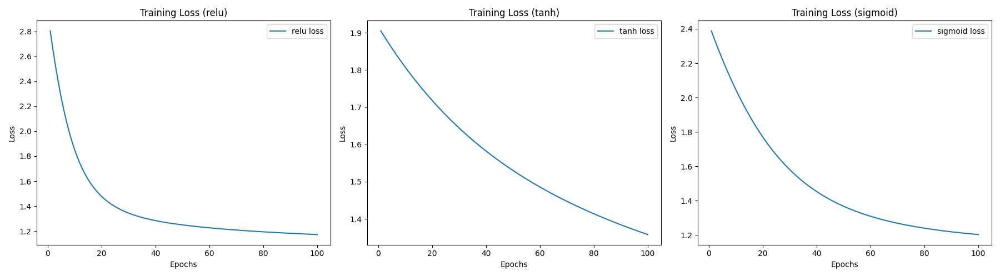

- plot the trend in loss with change in learning rate

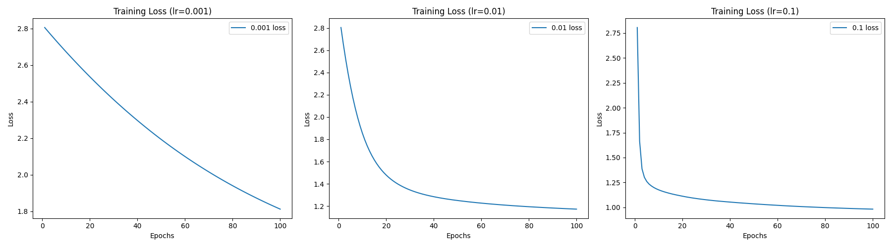

- plot the trend in loss with change in batch size

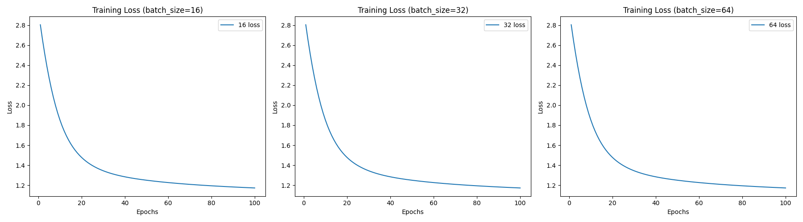


- Report the observations regarding the influence of each factor on model convergence
    - By varying the activation functions the intial loss itself will differ(relu>sigmoid>tanh). And finally the convergence is more in relu.
    - By varying learning rate the converge varies(0.1>0.01>0.001)
    - By varying batch size the convergence is same among all batch sizes.

### 2.6 Multi-label Classification(Hyperparameter tuning)
- link for wandb report
[Link Text](https://wandb.ai/keshava-kishora-iiit-hyderabad/smai_a3/sweeps/rbxlhlxl?nw=nwuserkeshavakishora "Optional Title")

- best hyperparameters and their corresponding metrics on test set
```
Best_hyperparameters :
    - lr = 0.1
    - epochs = 500
    - neurons = [64, 32]
    - optimizer = batch
    - activation = relu
Metrics : 
    - Hamming Loss:  0.27488
    - Accuracy:  0.7282825
    - Precision:  nan
    - Recall:  0.26370421453546455
    - Loss:  4.619652297796347

```

### 2.7 Analysis
- How the classifier biased towards to some classes
    - Class Label: '3', Correctly predicted: 0
    - Class Label: '4', Correctly predicted: 0
    - Class Label: '5', Correctly predicted: 36
    - Class Label: '6', Correctly predicted: 39
    - Class Label: '7', Correctly predicted: 7
    - Class Label: '8', Correctly predicted: 0

**Observations** - We can see that the model is able to make good predictions for class '5' and '6', but not for other classes. This is because the dataset is imbalanced and the model is biased towards the majority class.

## Multilayer perceptron regression
### 3.1 Preprocessing
- Description of dataset using mean, median, mode, max, min, std, quartiles
```
Description of column: CRIM
    count    486.000000
    mean       3.611874
    std        8.720192
    min        0.006320
    25%        0.081900
    50%        0.253715
    75%        3.560263
    max       88.976200
    Name: CRIM, dtype: float64

Description of column: ZN
    count    486.000000
    mean      11.211934
    std       23.388876
    min        0.000000
    25%        0.000000
    50%        0.000000
    75%       12.500000
    max      100.000000
    Name: ZN, dtype: float64

Description of column: INDUS
    count    486.000000
    mean      11.083992
    std        6.835896
    min        0.460000
    25%        5.190000
    50%        9.690000
    75%       18.100000
    max       27.740000
    Name: INDUS, dtype: float64

Description of column: CHAS
    count    486.000000
    mean       0.069959
    std        0.255340
    min        0.000000
    25%        0.000000
    50%        0.000000
    75%        0.000000
    max        1.000000
    Name: CHAS, dtype: float64

Description of column: NOX
    count    506.000000
    mean       0.554695
    std        0.115878
    min        0.385000
    25%        0.449000
    50%        0.538000
    75%        0.624000
    max        0.871000
    Name: NOX, dtype: float64

Description of column: RM
    count    506.000000
    mean       6.284634
    std        0.702617
    min        3.561000
    25%        5.885500
    50%        6.208500
    75%        6.623500
    max        8.780000
    Name: RM, dtype: float64

Description of column: AGE
    count    486.000000
    mean      68.518519
    std       27.999513
    min        2.900000
    25%       45.175000
    50%       76.800000
    75%       93.975000
    max      100.000000
    Name: AGE, dtype: float64

Description of column: DIS
    count    506.000000
    mean       3.795043
    std        2.105710
    min        1.129600
    25%        2.100175
    50%        3.207450
    75%        5.188425
    max       12.126500
    Name: DIS, dtype: float64

Description of column: RAD
    count    506.000000
    mean       9.549407
    std        8.707259
    min        1.000000
    25%        4.000000
    50%        5.000000
    75%       24.000000
    max       24.000000
    Name: RAD, dtype: float64

Description of column: TAX
    count    506.000000
    mean     408.237154
    std      168.537116
    min      187.000000
    25%      279.000000
    50%      330.000000
    75%      666.000000
    max      711.000000
    Name: TAX, dtype: float64

Description of column: PTRATIO
    count    506.000000
    mean      18.455534
    std        2.164946
    min       12.600000
    25%       17.400000
    50%       19.050000
    75%       20.200000
    max       22.000000
    Name: PTRATIO, dtype: float64

Description of column: B
    count    506.000000
    mean     356.674032
    std       91.294864
    min        0.320000
    25%      375.377500
    50%      391.440000
    75%      396.225000
    max      396.900000
    Name: B, dtype: float64

Description of column: LSTAT
    count    486.000000
    mean      12.715432
    std        7.155871
    min        1.730000
    25%        7.125000
    50%       11.430000
    75%       16.955000
    max       37.970000
    Name: LSTAT, dtype: float64

Description of column: MEDV
    count    506.000000
    mean      22.532806
    std        9.197104
    min        5.000000
    25%       17.025000
    50%       21.200000
    75%       25.000000
    max       50.000000
    Name: MEDV, dtype: float64
```
- Graph showing distribution of labels across the dataset

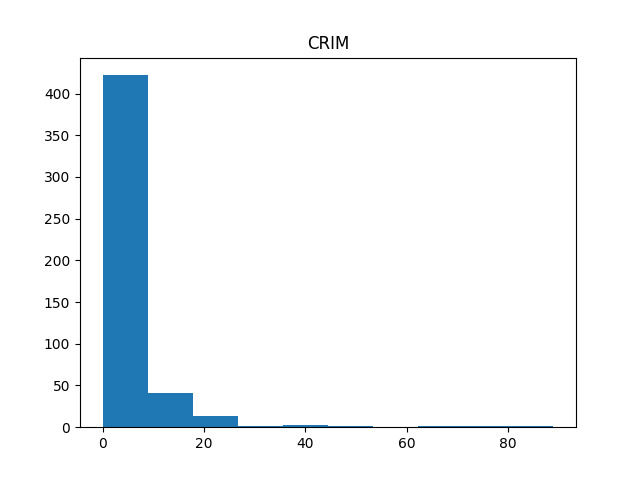
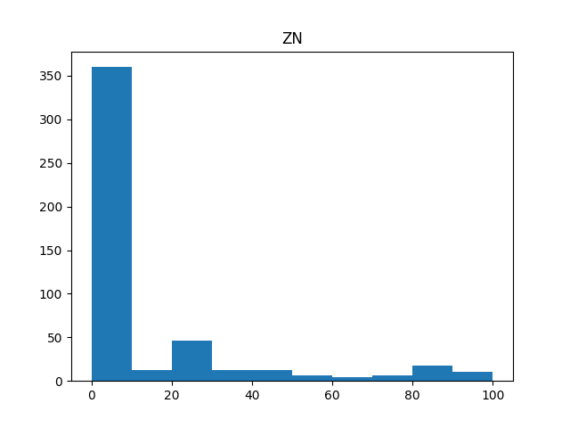
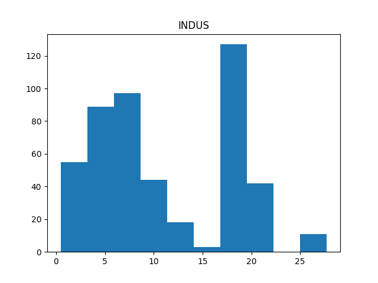
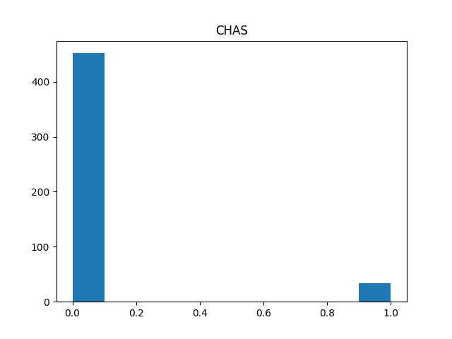
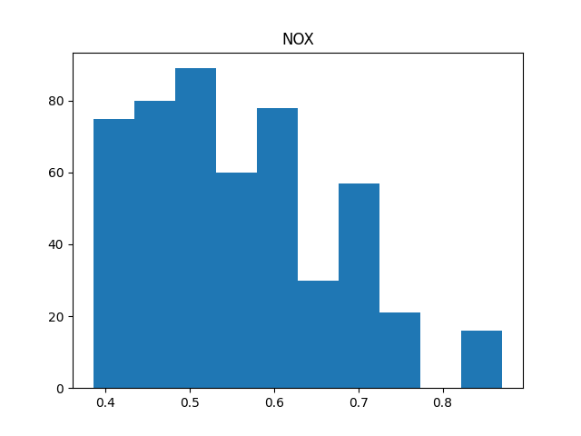
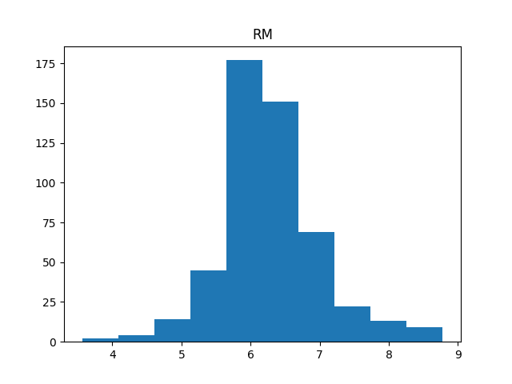
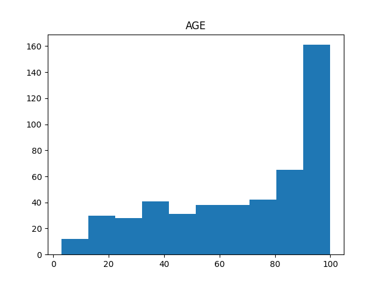
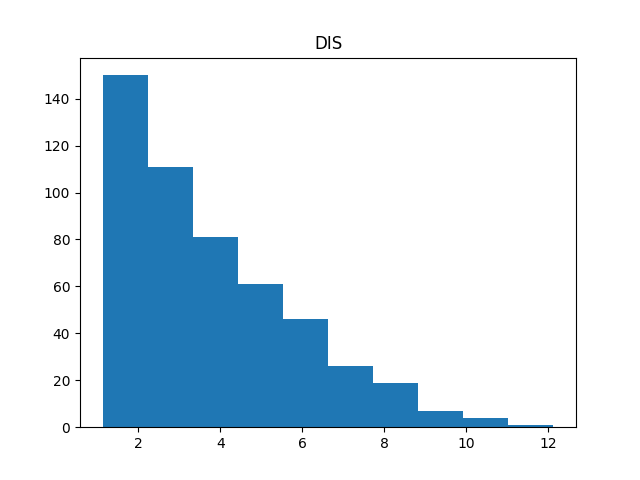
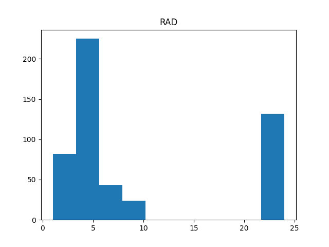
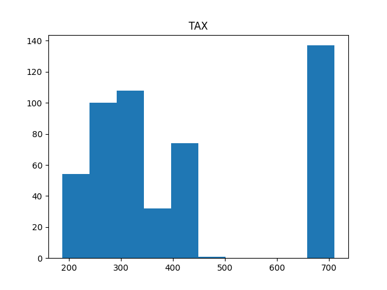
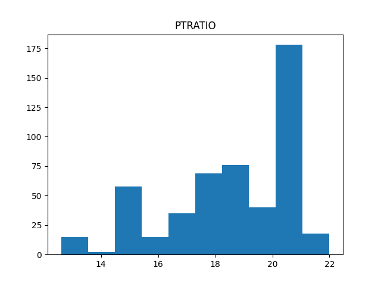
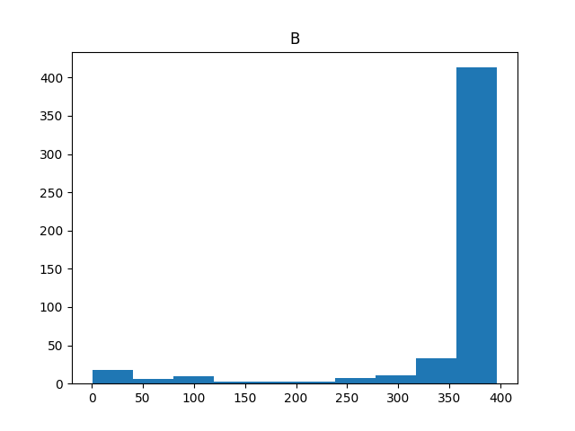
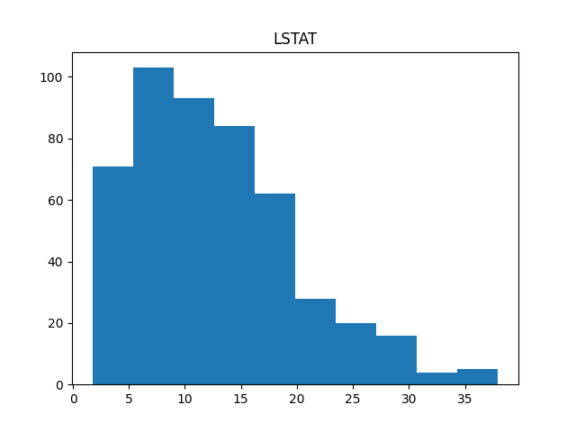
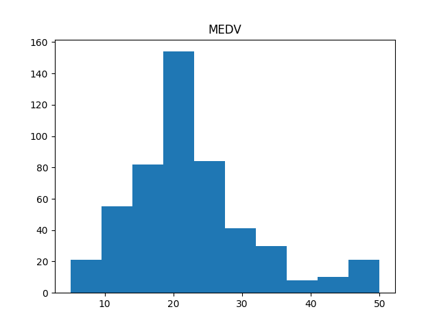

### 3.2 MLP Building for regression
- Gradient checking for the model
```
Epoch 1 Loss: 307.5887988490678
Layer 1 weights relative difference: 2.3960940523456833e-06
Layer 1 biases relative difference: 3.8649000989505066e-07
Layer 2 weights relative difference: 1.3541785398279997e-07
Layer 2 biases relative difference: 6.666378907968319e-08
Layer 3 weights relative difference: 9.165863230988236e-09
Layer 3 biases relative difference: 4.498309757766608e-09
Epoch 1 Loss: 307.5887988490678
Epoch 2 Loss: 301.4880883354513
Epoch 3 Loss: 295.5455012095661
Epoch 4 Loss: 289.748644919765
Epoch 5 Loss: 284.08625487183866
```

### 3.3 Hyperparameter tuning
- link for wandb report
[Link Text](https://wandb.ai/keshava-kishora-iiit-hyderabad/smai_a3/sweeps/uv4nt06u/table "Optional Title")

- plot the trend of validation losees with change in hyperparameters is shown in above link

- Generate a table listing all the hyperparameters and their corresponding metrics is shown n above link

- Provide the best hyperparameters and their corresponding metrics
```
Best_hyperparameters :
    - lr = 0.01
    - epochs = 500
    - neurons = [64, 32]
    - optimizer = batch
    - activation = tanh
```

### 3.4 Evaluating Single-label Regression Model
- Provide the metrices corresponding to the best model on the test set
```
Mean Squared Error: 5.206391364336392
Root Mean Squared Error: 2.281751819181129
R Squared: 0.9134235713240618
```

### 3.5 MSE vs BCE
- plot the loss vs epochs for both models in two different plots
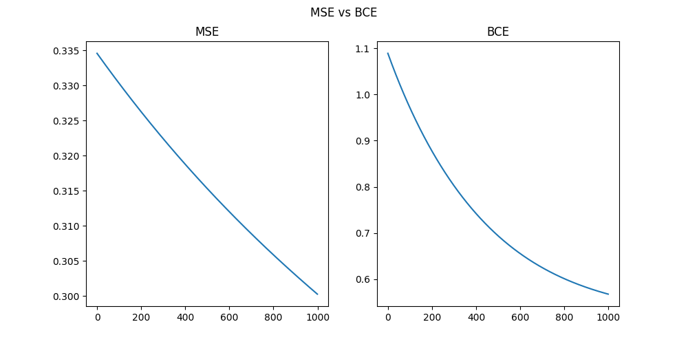

- Note down the observations and differences that you see in both loss functions. What do you see in the convergence plots.
    - BCE loss is more than the MSE loss for logistic regression.

### 3.6 Analysis
- Report the observations regarding the influence of each factor on model convergence

1. High-Value Property Underprediction:
    The model demonstrates a significant tendency to underestimate values for properties at the upper end of the scale (actual value of 50.0). These high-value properties typically exhibit elevated levels across multiple features, including INDUS, NOX, AGE, RAD, and TAX.
2. Low-Value Property Overprediction:
    For properties in the lower value range (13-22), the model shows a propensity to overestimate. These properties are often characterized by low crime rates (CRIM) and moderate to high AGE values.

### Bonus
- Regression and classification are done in single MLP class, also Multi label classification is also done in same MLP class.

## AutoEncoders

### 4.3 KNN classification on reduced data
- Train a KNN model on the reduced data
- Report the accuracy of the model
```
accuracy : 0.25195007800312014
precision_macro : 0.23436060313003823
recall_macro : 0.22640849400568702
f1_macro : 0.23031592847168142
precision_micro : 0.25195007800312014
recall_micro : 0.25195007800312014
f1_micro : 0.25195007800312014
```

- comapre the accuaracy of KNN model from Assignment1 and Assignment2
```
I have done dimensionality reduction on spotify data then applied KNN on reduced data using PCA.The metrics are as follows:
- The accuracy of the model is: 0.19578783151326054
- The micro precision of the model is: 0.19578783151326054
- The macro precision of the model is: 0.19460767066409468
- The micro recall of the model is: 0.19578783151326054
- The macro recall of the model is: 0.17599305673429366
- The F1 micro score of the model is: 0.1957878315132605
- The F1 macro score of the model is: 0.18483287426091377
```

```
I have done KNN on original data. The metrics are as follows:
- The accuracy of the model is: 0.3691776242478271
- The micro precision of the model is: 0.3691776242478271
- The macro precision of the model is: 0.36903572610713287
- The micro recall of the model is: 0.3691776242478271
- The macro recall of the model is: 0.3326440968810003
- The F1 micro score of the model is: 0.3691776242478271
- The F1 macro score of the model is: 0.3498962113659285
```

### 4.4 MLP classification on reduced data
- Train a MLP model on the reduced data
- Report the accuracy of the model
```
accuracy : 0.06685981724983285
precision_macro : 0.03831504885682528
recall_macro : 0.05559058275908048
f1_macro : 0.045363752050687135
precision_micro : 0.06685981724983285
recall_micro : 0.06685981724983285
f1_micro : 0.06685981724983285
```