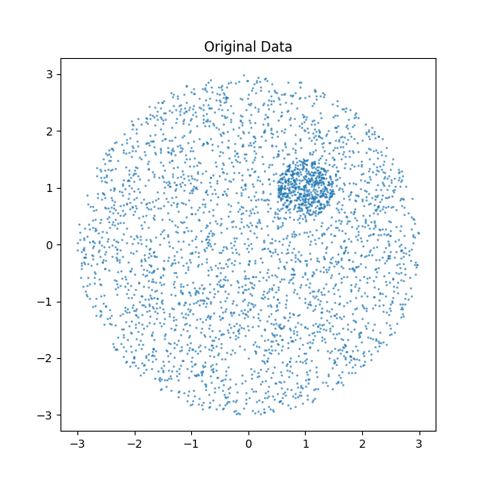
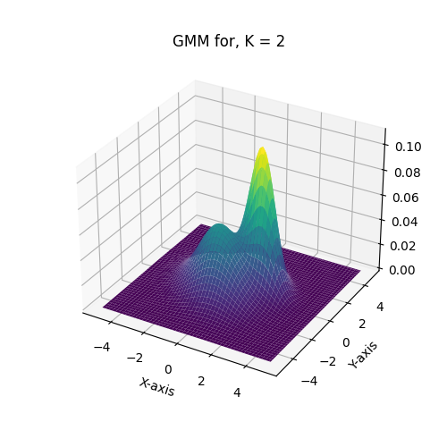
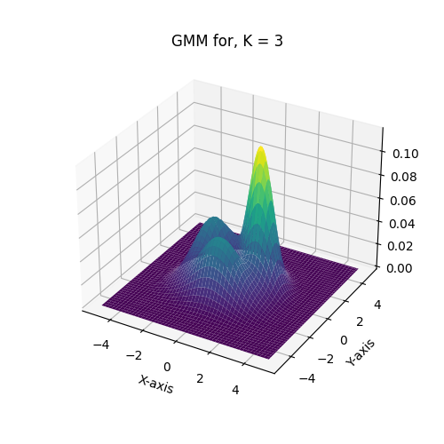
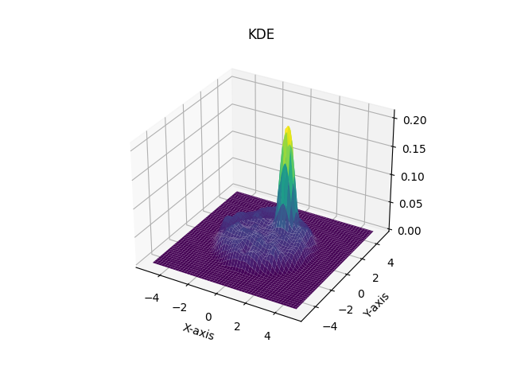
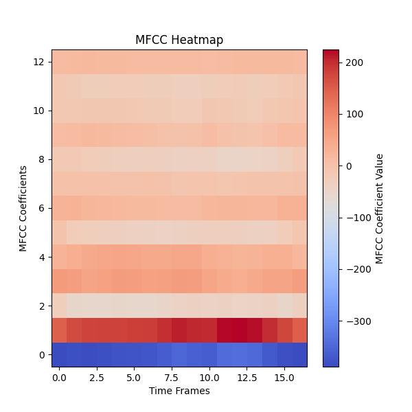

# Assignment-5
## Question1 : Kernel Density Estimation(KDE)

### TASK 2:
We have generated the dataset as shown in the figure below.



### TASK 3:
 The Probability distribution when we used GMM with three different components is shown in the figure below.

<p align="center">
  
  
  
</p>

 - As the number of components increases, the probability ditribution around the more dense circle is increasing(forming guassian kind of bell) beacuse the GMM is forming the clusters which forms cluster number of guassian distributions around the dense circle.

 The Probability distribution when we used KDE with three different bandwidths is shown in the figure below.




- The KDE model is able to consistently fit to the generated data.


## Question 2 : Hidden Markov Model(HMM)

### TASK 1:
Visualization of Audio files(.wav) by converting them into MFCC features. Here is the Heat map of the MFCC features of the onr audio file.



 - Explain patterns in the Audio signals by observing the Heat map of the MFCC features.
    - The lower coefficients (Rows 0-2) exhibit strong variations and higher intensity values (red regions), indicating that the signal is dominated by low-frequency components.
    - The higher coefficients (Rows 3-12) show less variation and weaker intensities, suggesting that higher-frequency components are less prominent.
    
    - This is typical for speech and many natural sounds where lower frequencies carry more energy.
    
    - Through out the time frame there is a sound of low frequencies which indicates that person always speaking in the audio file.

 - Can these patterns explain why HMM is a suitable method for this task.
    - In this heap map, every time frame has set of coefficients and as time frame increases the coefficients are changing. So, here each time frame is considered as state and we can learn the transition between the states using HMM.
    So, HMM is a suitable method for this task because it can learn the transition between the states and can predict the next state based on the previous states.
    
 ### TASK 3:
 - Performance on the test data using the HMM model. The performance is shown in the figure below.
 ```
    Accuracy:  0.9433333333333334
 ```

 - Performance on the realtime data using the HMM model. The performance is shown in the figure below.
 ```
Predicted: 1, Actual: 0
Predicted: 0, Actual: 1
Predicted: 2, Actual: 2
Predicted: 2, Actual: 3
Predicted: 0, Actual: 4
Predicted: 1, Actual: 5
Predicted: 0, Actual: 6
Predicted: 4, Actual: 7
Predicted: 1, Actual: 8
Predicted: 1, Actual: 9
Accuracy:  0.1
```

 It is Giving better performance on the test data than the realtime data because the model is trained on the data similar to testdata and the model is able to predict the test data more accurately than the realtime data. Also in my dataset i am talking at the end of the audio file so the model is not able to predict the realtime data accurately.